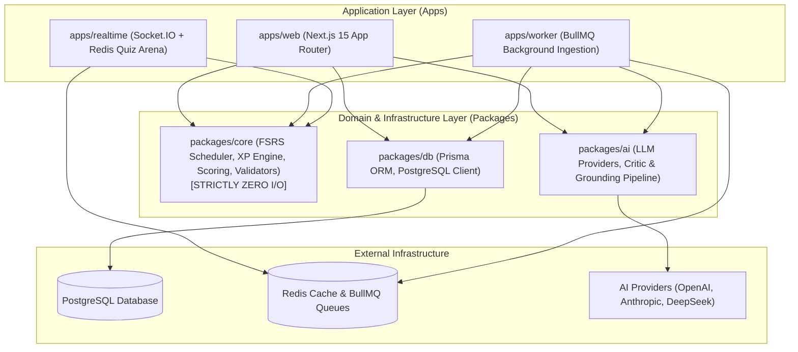
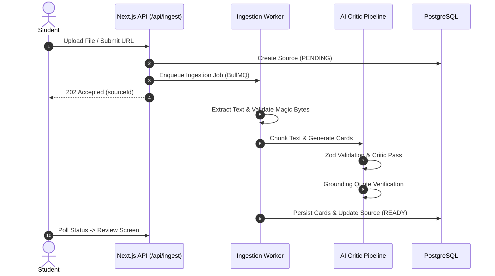

# Chizmo System Architecture & Data Flows

## 1. Monorepo Package Topology

```mermaid
flowchart TD
  subgraph Apps["Application Layer (Apps)"]
    Web["apps/web (Next.js 15 App Router)"]
    Worker["apps/worker (BullMQ Background Ingestion)"]
    Realtime["apps/realtime (Socket.IO + Redis Quiz Arena)"]
  end

  subgraph Packages["Domain & Infrastructure Layer (Packages)"]
    Core["packages/core (FSRS Scheduler, XP Engine, Scoring, Validators)\n[STRICTLY ZERO I/O]"]
    Db["packages/db (Prisma ORM, PostgreSQL Client)"]
    AI["packages/ai (LLM Providers, Critic & Grounding Pipeline)"]
  end

  subgraph External["External Infrastructure"]
    Postgres[("PostgreSQL Database")]
    RedisCache[("Redis Cache & BullMQ Queues")]
    LLMs["AI Providers (OpenAI, Anthropic, DeepSeek)"]
  end

  Web --> Core
  Web --> Db
  Web --> AI
  Worker --> Core
  Worker --> Db
  Worker --> AI
  Realtime --> Core
  Realtime --> RedisCache

  Db --> Postgres
  Worker --> RedisCache
  AI --> LLMs
```

## 2. Content Ingestion & AI Generation Sequence

```mermaid
sequenceDiagram
  autonumber
  actor User as Student
  participant Web as Next.js API (/api/ingest)
  participant Worker as Ingestion Worker
  participant AI as AI Critic Pipeline
  participant DB as PostgreSQL

  User->>Web: Upload File / Submit URL
  Web->>DB: Create Source (PENDING)
  Web->>Worker: Enqueue Ingestion Job (BullMQ)
  Web-->>User: 202 Accepted (sourceId)

  Worker->>Worker: Extract Text & Validate Magic Bytes
  Worker->>AI: Chunk Text & Generate Cards
  AI->>AI: Zod Validation & Critic Pass
  AI->>AI: Grounding Quote Verification
  Worker->>DB: Persist Cards & Update Source (READY)
  User->>Web: Poll Status -> Review Screen
```
